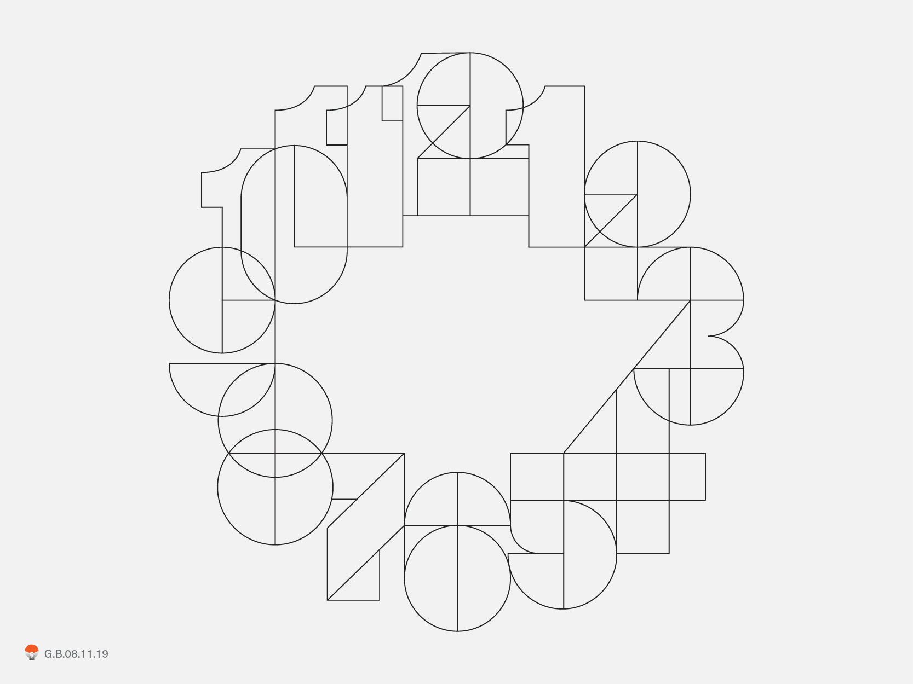
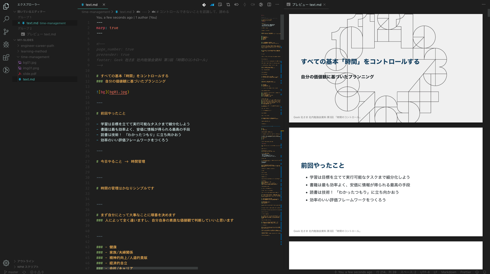

<!--
page_number: true
prerender: true
footer: Geek 社さま 社内勉強会資料 第3回 「時間のコントロール」
-->

# すべての基本「時間」をコントロールする
### 自分の価値観に基づいたプランニング

---

# 前回やったこと

- 学習は目標を立てて実行可能なタスクまで細分化しよう
- 書籍は最も効率よく、安価に情報が得られる最高の手段
- 読書は技術！ 「わかったつもり」に立ち向かおう
- 効率のいい評価フレームワークをつくろう

---

# 今日やること -> 時間管理

---

# 時間の管理はかなりシンプルです

---

# まず自分にとって大事なことに順番を決めます
### 人によって全く違いますし、自分自身の素直な価値観で判断していいと思います

---

### - 健康
### - 家族/夫婦関係
### - 精神的向上/人道的貢献
### - 経済的自立
### - 会社/キャリア
### - 会社/戦略
### - 地域社会/政治
### - 教育

---

### 1. 昨日1日の自分の行動を書き出します
### 2. 優先順位の上位にあるものはあるか見てみます
### 3. 優先順位が高いのに、なぜ普段できないのかを考えてみてください

---

### カメラの修理を依頼した。歯医者への電話もした。2時までにということで上司から頼まれたレポートも提出した。お客さまとの飲み会にも出た。仕事上の難しい問題もみんな処理した。

### しかし、妻とじっくり会話を楽しむことも、子供を連れて公園に出かけることも、良い本を読むこともできなかった。

---

### どうして最も大切なことを、どうでもいいことの犠牲にしてしまうのだろう？
### 大切なことを後回しにすると、無駄に焦燥感や罪悪感を抱えて自尊心が低くなり、生産性の低下に繋がる。

---

# 逆にいえば

---

# 最も大切なことを実行し続けると、常に自分に満足して自尊心が満たされ、穏やかに過ごせる。

---

# 穏やかなときと、イライラしてたりいっぱいいっぱいなとき、どちらの生産性が高いですか？

---

# まずは重要なことを書き出して認識してみましょう！

---

# そして毎日10分〜15分起きた後の時間を「プランニング」に充てます

---

# 重要な出来事のためのスペースを予め確保しておきます
### 子供と出かける、いい本を読む、なんでもいいです！

---

# Todo ツールにタスクとして一旦全部ぶちこむ

---

# 長期目標の目標設定も同じ要領です！

---

## SMART の法則とか、いろんなやり方があります。
## 最初はとりあえず、以下の4つを意識してみてください。
#### 1. 具体性がある
#### 2. 計測ができる
#### 3. 期日が決まっている
#### 4. 現実的である（小さめである）

---

# 例: 11月末までに〇〇の書籍を1冊読み切って、読書ノートをつける

---

# まずはどうやれば達成できるか分析

---

### 1. 選書のための事前調査を行う（背景・歴史・ルーツなど自分が知りたいこと）2時間
### 2. 棚見を行う 2時間
### 3. 書籍を購入
### 4. 300ページを15日で読み切る
### 5. 1日あたり20ページ
### 6. 20ページ読み進めるのに必要な時間は30分
### 7. -11/15 選書を終える
### 8. 11/15-毎日30分読書の習慣を作る

---

# 実行可能タスクまで細分化

---

### 1. TypeScript の生まれた経緯を調べて Google ドキュメントに整形した状態で保存 30分
### 2. TypeScript のルーツを Google ドキュメントに整形した状態で保存 30分
### 3. TypeScript についての概要がなんとなく把握できているかを確認するために妻に話す 30分
### 4. 妻と話した上で理解できていなかった点をドキュメントに整形した状態で保存 30分
### 5. 棚見を終えて書籍を購入できる状態にする 2時間
### 6. ○○書店で書籍を購入する
### 7. 15回分 30分の読書時間を確保する

---

## タスク化するときははできるだけ「そのタスクが完了するとどういう状態になるのか」が明確な状態だとやりやすいです

---

# 実演

---

# 襲いかかる外的干渉
### 重要な仕事と緊急な仕事の違い

---

# 自分の価値観の優先順位を思い出す

---

# コントロールできないことを認識して、諦める

## - 天気
## - 災害
## - 妻や子供
## - 他人の思考や感情

---

# ツール、コミュニケーションで不必要なタスクや中断はかなり減る（経験談）

---

# 導入することで明らかにストレスや時間が減るツールは有料でも迷わず導入
（概ね無料期間とかあるし、迷う時間がもったいないのでさっさと試してみよう）

## - Youtube Premium
## - Todoist
## - flier

## など！

---

# このスライドも実はめっちゃ楽して作っています（小声）

---

---

# やたら中断される場合の対処法

- 本人に伝える（やさしく -> 直球）
- 定期面談を設ける
- どうにかしてツールで対処できないか考える
- どうにかして自分以外の人員で対応できないか考える
- 受け入れる👼（でもほぼここまで行くことはないはずです）

---

# キャラクター作り

---

# 家族が大好きおじさん「飲み会ですか？ すみません、今夜は子供と出かける予定で」
# 同僚「ふふ、やっぱり家族思いだな」

＿人人人人人人人＿
＞　平和な世界　＜
￣Y^Y^Y^Y^Y^Y￣

---

# プランニングの際に余白を意識してみてください
### 常にいっぱいいっぱいのタスクを詰め込んでいる状況だと改善するための新たなタスクを入れる余裕がなくなります。差し込みや中断が来た場合に重要な出来事をカットしなくてはいけない可能性が高くなります

---

# これで重要な出来事に取り組むスペースができました！

---

# 時間管理は時間を管理しようとするじゃなくて、出来事を管理するということ

---

# ここまでのお話し

## 自分にとって重要な出来事を認識する
## 目標を設定する（任意）
## 重要な出来事のスペースを予め確保して「プランニング」
## 毎日調整
## 外的な作業や中断で埋めないようにして自分の自尊心を傷つけない
## 便利なツールは全力で使う（時間のためのお金は惜しまない）

---

# これでいつでもみねぎしさん！

---

## > イメージしてたのは業務効率化なんだけど...

---

# ここまでだけでもかなり生産性はあがります！

---

# さらに、プランニングしていく中で自分のことが段々見えてくるはずです

---

- ## ミーティングに時間がかかりすぎてるな...（段取りが悪いのかな？）
- ## 確認漏れで手戻りが発生することが多いな...（自分のチェック機構がうまく機能してない？）
- ## ちょっと話しかけるつもりが毎回かなり時間がかかってる...（結論から端的にコミュニケーションできてないかも）

---

- ## どうやったら段取りがよくなるんだろう
- ## もっと自分のチェックの確実性を上げるにはどうすればいいんだろう
- ## 端的にできるコミュニケーションってどうすればいいんだろう

---

## 1. ひとつずつ、ゆっくり目標にして
## 2. 細分化して実行可能なタスクにして
## 3. Todo ツールにぶち込んで
## 4. 実行していくだけ！

---

## 自分の価値観を完璧に全て100%満足さえることは、100年ではどうやっても足りないと気づきます

---

## でも「自分にとって重要なこと」がわかっていれば「選ぶこと」ができます！

---

## 今日から Todoist を使ってみてください。
## 今夜からプランニングしてみてください。

---

# おすすめプランニング方法

---

# 「日記を書く」（自己分析）

---

## 1. 思うままに第三者視点で合理的に淡々と事実を並べる（RPG のステータスチェックに近い感覚）
## 2. 主観的な視点に変化させ、がんばれたところを自覚してうれしい気持ちになる
## 3. 自分、あるいは環境に感じている不満に気づいたら Todoist の inbox にとにかく突っ込みまくる

---

# Todoist を整理する（プランニング）

---

## 1. 重要な出来事、長期目標のためのタスクをインボックスに書き出す
## 2. それぞれのタスクを1週間以内にできるか判断する
## 3. できるものは配置していく。できないものは思い切って削除する

---

# ツールに頼ろう・・！

---

### 日記 -> Google Calender の API 叩いてエディターでがーっと書いたものを毎日の固定の予定みたいな形で挿入できたら、管理もクラウドで無料だし、一覧性めっちゃあるしどこからでもアクセスできるしめっちゃ楽では

---

# 毎日日記・プランニングの時間を確保していればそんなに大変じゃない
# どんなにめんどくさくても、日記を「正しく」つける習慣があれば余裕が生まれます

---

# 「学習」「習慣」「時間管理」

---

### 古くから言われてきたことです。
### 誰しも一度は「大切だ」と歴史から学んだことです。
### なぜ義務教育の必修科目に歴史や道徳があったか、なんとなくわかりませんか？
### なのになぜそれらを軽視してしまうのか

---

- ## タスク多すぎかも
- ## どうでもいい情報受け入れすぎかも（好きでもない芸能人がどうとか、よく知らないサービスの炎上）
- ## 時間を奪うコンテンツが多すぎることを理解できてないかも（ネトフリアマプラユーチューブ）
- ## 承認欲求満たしたさ〜が強すぎるかも
- ## 「情報収集」によって得られる情報のコスパをよくわかってないかも

---

## ほんとにその時間、それらの出来事によって「それ以外の全てのやりたいことを捨てる」のかよく考えてみてください。（思い出そう優先順位！）

---

## そうして自分の人生に余白を作って、まずは歴史を「知って」「理解」しましょう。

---

## 多分ほとんどの人が実行しません

---

## 明らかにやったほうがいいのに、なぜかやらない
#### 隣り合う全く同じ商品の高い方を選んでいくような違和感

---

## 大きく捉えすぎているのかも（細分化が足りないのかも）

---

## 自分が行動できると思うところまでとにかく細分化しまくってみてください！

---

# これで一般枠は終了です！
# 次回からエンジニアリングに関する勉強会になります（ハンズオンとかになるかもしれません）

---

# ご静聴ありがとうございました！
